# Regional Effects (unknown black-box function)

This tutorial use the same dataset with the previous [tutorial](./03_regional_effects_synthetic_f/), but instead of explaining the known (synthetic) predictive function, we fit a neural network on the data and explain the neural network. This is a more realistic scenario, since in real-world applications we do not know the underlying function and we only have access to the data. We advise the reader to first read the previous tutorial.


```python
import numpy as np
import effector
import keras
import tensorflow as tf

np.random.seed(12345)
tf.random.set_seed(12345)
```

    2025-02-06 16:11:29.880936: I external/local_xla/xla/tsl/cuda/cudart_stub.cc:32] Could not find cuda drivers on your machine, GPU will not be used.
    2025-02-06 16:11:29.883625: I external/local_xla/xla/tsl/cuda/cudart_stub.cc:32] Could not find cuda drivers on your machine, GPU will not be used.
    2025-02-06 16:11:29.892498: E external/local_xla/xla/stream_executor/cuda/cuda_fft.cc:477] Unable to register cuFFT factory: Attempting to register factory for plugin cuFFT when one has already been registered
    WARNING: All log messages before absl::InitializeLog() is called are written to STDERR
    E0000 00:00:1738854689.907802  164985 cuda_dnn.cc:8310] Unable to register cuDNN factory: Attempting to register factory for plugin cuDNN when one has already been registered
    E0000 00:00:1738854689.912281  164985 cuda_blas.cc:1418] Unable to register cuBLAS factory: Attempting to register factory for plugin cuBLAS when one has already been registered
    2025-02-06 16:11:29.927531: I tensorflow/core/platform/cpu_feature_guard.cc:210] This TensorFlow binary is optimized to use available CPU instructions in performance-critical operations.
    To enable the following instructions: AVX2 FMA, in other operations, rebuild TensorFlow with the appropriate compiler flags.


## Simulation example

### Data Generating Distribution

We will generate $N=500$ examples with $D=3$ features, which are in the uncorrelated setting all uniformly distributed as follows:

<center>

| Feature | Description                                | Distribution                 |
|---------|--------------------------------------------|------------------------------|
| $x_1$   | Uniformly distributed between $-1$ and $1$ | $x_1 \sim \mathcal{U}(-1,1)$ |
| $x_2$   | Uniformly distributed between $-1$ and $1$ | $x_2 \sim \mathcal{U}(-1,1)$ |
| $x_3$   | Uniformly distributed between $-1$ and $1$ | $x_3 \sim \mathcal{U}(-1,1)$ |

</center>

For the correlated setting we keep the distributional assumptions for $x_2$ and $x_3$ but define $x_1$ such that it is highly correlated with $x_3$ by: $x_1 = x_3 + \delta$ with $\delta \sim \mathcal{N}(0,0.0625)$.


```python
def generate_dataset_uncorrelated(N):
    x1 = np.random.uniform(-1, 1, size=N)
    x2 = np.random.uniform(-1, 1, size=N)
    x3 = np.random.uniform(-1, 1, size=N)
    return np.stack((x1, x2, x3), axis=-1)

def generate_dataset_correlated(N):
    x3 = np.random.uniform(-1, 1, size=N)
    x2 = np.random.uniform(-1, 1, size=N)
    x1 = x3 + np.random.normal(loc = np.zeros_like(x3), scale = 0.25)
    return np.stack((x1, x2, x3), axis=-1)

# generate the dataset for the uncorrelated and correlated setting
N = 1000
X_uncor_train = generate_dataset_uncorrelated(N)
X_uncor_test = generate_dataset_uncorrelated(10000)
X_cor_train = generate_dataset_correlated(N)
X_cor_test = generate_dataset_correlated(10000)
```

### Black-box function

We will use the following linear model with a subgroup-specific interaction term:
 $$ y = 3x_1I_{x_3>0} - 3x_1I_{x_3\leq0} + x_3$$ 
 
On a global level, there is a high heterogeneity for the features $x_1$ and $x_3$ due to their interaction with each other. However, this heterogeneity vanishes to 0 if the feature space is separated into subregions:

<center>

| Feature | Region      | Average Effect | Heterogeneity |
|---------|-------------|----------------|---------------|
| $x_1$   | $x_3>0$     | $3x_1$         | 0             |
| $x_1$   | $x_3\leq 0$ | $-3x_1$        | 0             |
| $x_2$   | all         | 0              | 0             |
| $x_3$   | $x_3>0$     | $x_3$          | 0             |
| $x_3$   | $x_3\leq 0$ | $x_3$          | 0             |

</center>


```python
def generate_target(X):
    f = np.where(X[:,2] > 0, 3*X[:,0] + X[:,2], -3*X[:,0] + X[:,2])
    epsilon = np.random.normal(loc = np.zeros_like(X[:,0]), scale = 0.1)
    Y = f + epsilon
    return(Y)

# generate target for uncorrelated and correlated setting
Y_uncor_train = generate_target(X_uncor_train)
Y_uncor_test = generate_target(X_uncor_test)
Y_cor_train = generate_target(X_cor_train)
Y_cor_test = generate_target(X_cor_test)      
```

### Fit a Neural Network

We create a two-layer feedforward Neural Network, a weight decay of 0.01 for 100 epochs. We train two instances of this NN, one on the uncorrelated and one on the correlated setting. In both cases, the NN achieves a Mean Squared Error of about $0.17$ units.


```python
# Train - Evaluate - Explain a neural network
model_uncor = keras.Sequential([
    keras.layers.Dense(10, activation="relu", input_shape=(3,)),
    keras.layers.Dense(10, activation="relu", input_shape=(3,)),
    keras.layers.Dense(1)
])

optimizer = keras.optimizers.Adam(learning_rate=0.01)
model_uncor.compile(optimizer=optimizer, loss="mse")
model_uncor.fit(X_uncor_train, Y_uncor_train, epochs=100)
model_uncor.evaluate(X_uncor_test, Y_uncor_test)
```

    Epoch 1/100


    /home/givasile/miniconda3/envs/effector-dev/lib/python3.10/site-packages/keras/src/layers/core/dense.py:87: UserWarning: Do not pass an `input_shape`/`input_dim` argument to a layer. When using Sequential models, prefer using an `Input(shape)` object as the first layer in the model instead.
      super().__init__(activity_regularizer=activity_regularizer, **kwargs)
    2025-02-06 16:11:31.598334: E external/local_xla/xla/stream_executor/cuda/cuda_driver.cc:152] failed call to cuInit: INTERNAL: CUDA error: Failed call to cuInit: CUDA_ERROR_COMPAT_NOT_SUPPORTED_ON_DEVICE: forward compatibility was attempted on non supported HW
    2025-02-06 16:11:31.598368: I external/local_xla/xla/stream_executor/cuda/cuda_diagnostics.cc:137] retrieving CUDA diagnostic information for host: givasile-ubuntu-XPS-15-9500
    2025-02-06 16:11:31.598377: I external/local_xla/xla/stream_executor/cuda/cuda_diagnostics.cc:144] hostname: givasile-ubuntu-XPS-15-9500
    2025-02-06 16:11:31.598577: I external/local_xla/xla/stream_executor/cuda/cuda_diagnostics.cc:168] libcuda reported version is: 560.35.5
    2025-02-06 16:11:31.598612: I external/local_xla/xla/stream_executor/cuda/cuda_diagnostics.cc:172] kernel reported version is: 550.120.0
    2025-02-06 16:11:31.598621: E external/local_xla/xla/stream_executor/cuda/cuda_diagnostics.cc:262] kernel version 550.120.0 does not match DSO version 560.35.5 -- cannot find working devices in this configuration


    32/32 ━━━━━━━━━━━━━━━━━━━━ 1s 818us/step - loss: 2.8711
    Epoch 2/100
    32/32 ━━━━━━━━━━━━━━━━━━━━ 0s 713us/step - loss: 1.1402
    Epoch 3/100
    32/32 ━━━━━━━━━━━━━━━━━━━━ 0s 618us/step - loss: 0.4964
    Epoch 4/100
    32/32 ━━━━━━━━━━━━━━━━━━━━ 0s 644us/step - loss: 0.3660
    Epoch 5/100
    32/32 ━━━━━━━━━━━━━━━━━━━━ 0s 579us/step - loss: 0.2936
    Epoch 6/100
    32/32 ━━━━━━━━━━━━━━━━━━━━ 0s 694us/step - loss: 0.2423
    Epoch 7/100
    32/32 ━━━━━━━━━━━━━━━━━━━━ 0s 576us/step - loss: 0.2082
    Epoch 8/100
    32/32 ━━━━━━━━━━━━━━━━━━━━ 0s 605us/step - loss: 0.1855
    Epoch 9/100
    32/32 ━━━━━━━━━━━━━━━━━━━━ 0s 619us/step - loss: 0.1674
    Epoch 10/100
    32/32 ━━━━━━━━━━━━━━━━━━━━ 0s 629us/step - loss: 0.1528
    Epoch 11/100
    32/32 ━━━━━━━━━━━━━━━━━━━━ 0s 593us/step - loss: 0.1407
    Epoch 12/100
    32/32 ━━━━━━━━━━━━━━━━━━━━ 0s 594us/step - loss: 0.1303
    Epoch 13/100
    32/32 ━━━━━━━━━━━━━━━━━━━━ 0s 616us/step - loss: 0.1200
    Epoch 14/100
    32/32 ━━━━━━━━━━━━━━━━━━━━ 0s 618us/step - loss: 0.1132
    Epoch 15/100
    32/32 ━━━━━━━━━━━━━━━━━━━━ 0s 602us/step - loss: 0.1068
    Epoch 16/100
    32/32 ━━━━━━━━━━━━━━━━━━━━ 0s 690us/step - loss: 0.1020
    Epoch 17/100
    32/32 ━━━━━━━━━━━━━━━━━━━━ 0s 593us/step - loss: 0.0960
    Epoch 18/100
    32/32 ━━━━━━━━━━━━━━━━━━━━ 0s 580us/step - loss: 0.0930
    Epoch 19/100
    32/32 ━━━━━━━━━━━━━━━━━━━━ 0s 609us/step - loss: 0.0897
    Epoch 20/100
    32/32 ━━━━━━━━━━━━━━━━━━━━ 0s 659us/step - loss: 0.0877
    Epoch 21/100
    32/32 ━━━━━━━━━━━━━━━━━━━━ 0s 628us/step - loss: 0.0834
    Epoch 22/100
    32/32 ━━━━━━━━━━━━━━━━━━━━ 0s 617us/step - loss: 0.0820
    Epoch 23/100
    32/32 ━━━━━━━━━━━━━━━━━━━━ 0s 627us/step - loss: 0.0774
    Epoch 24/100
    32/32 ━━━━━━━━━━━━━━━━━━━━ 0s 592us/step - loss: 0.0778
    Epoch 25/100
    32/32 ━━━━━━━━━━━━━━━━━━━━ 0s 615us/step - loss: 0.0727
    Epoch 26/100
    32/32 ━━━━━━━━━━━━━━━━━━━━ 0s 620us/step - loss: 0.0723
    Epoch 27/100
    32/32 ━━━━━━━━━━━━━━━━━━━━ 0s 603us/step - loss: 0.0699
    Epoch 28/100
    32/32 ━━━━━━━━━━━━━━━━━━━━ 0s 612us/step - loss: 0.0685
    Epoch 29/100
    32/32 ━━━━━━━━━━━━━━━━━━━━ 0s 659us/step - loss: 0.0654
    Epoch 30/100
    32/32 ━━━━━━━━━━━━━━━━━━━━ 0s 655us/step - loss: 0.0672
    Epoch 31/100
    32/32 ━━━━━━━━━━━━━━━━━━━━ 0s 722us/step - loss: 0.0668
    Epoch 32/100
    32/32 ━━━━━━━━━━━━━━━━━━━━ 0s 634us/step - loss: 0.0633
    Epoch 33/100
    32/32 ━━━━━━━━━━━━━━━━━━━━ 0s 669us/step - loss: 0.0654
    Epoch 34/100
    32/32 ━━━━━━━━━━━━━━━━━━━━ 0s 694us/step - loss: 0.0680
    Epoch 35/100
    32/32 ━━━━━━━━━━━━━━━━━━━━ 0s 625us/step - loss: 0.0636
    Epoch 36/100
    32/32 ━━━━━━━━━━━━━━━━━━━━ 0s 616us/step - loss: 0.0637
    Epoch 37/100
    32/32 ━━━━━━━━━━━━━━━━━━━━ 0s 737us/step - loss: 0.0658
    Epoch 38/100
    32/32 ━━━━━━━━━━━━━━━━━━━━ 0s 751us/step - loss: 0.0630
    Epoch 39/100
    32/32 ━━━━━━━━━━━━━━━━━━━━ 0s 785us/step - loss: 0.0618
    Epoch 40/100
    32/32 ━━━━━━━━━━━━━━━━━━━━ 0s 679us/step - loss: 0.0615
    Epoch 41/100
    32/32 ━━━━━━━━━━━━━━━━━━━━ 0s 684us/step - loss: 0.0628
    Epoch 42/100
    32/32 ━━━━━━━━━━━━━━━━━━━━ 0s 774us/step - loss: 0.0586
    Epoch 43/100
    32/32 ━━━━━━━━━━━━━━━━━━━━ 0s 824us/step - loss: 0.0614
    Epoch 44/100
    32/32 ━━━━━━━━━━━━━━━━━━━━ 0s 661us/step - loss: 0.0590
    Epoch 45/100
    32/32 ━━━━━━━━━━━━━━━━━━━━ 0s 702us/step - loss: 0.0595
    Epoch 46/100
    32/32 ━━━━━━━━━━━━━━━━━━━━ 0s 761us/step - loss: 0.0594
    Epoch 47/100
    32/32 ━━━━━━━━━━━━━━━━━━━━ 0s 699us/step - loss: 0.0600
    Epoch 48/100
    32/32 ━━━━━━━━━━━━━━━━━━━━ 0s 865us/step - loss: 0.0556
    Epoch 49/100
    32/32 ━━━━━━━━━━━━━━━━━━━━ 0s 750us/step - loss: 0.0547
    Epoch 50/100
    32/32 ━━━━━━━━━━━━━━━━━━━━ 0s 727us/step - loss: 0.0612
    Epoch 51/100
    32/32 ━━━━━━━━━━━━━━━━━━━━ 0s 604us/step - loss: 0.0546
    Epoch 52/100
    32/32 ━━━━━━━━━━━━━━━━━━━━ 0s 775us/step - loss: 0.0555
    Epoch 53/100
    32/32 ━━━━━━━━━━━━━━━━━━━━ 0s 1ms/step - loss: 0.0587 
    Epoch 54/100
    32/32 ━━━━━━━━━━━━━━━━━━━━ 0s 788us/step - loss: 0.0559
    Epoch 55/100
    32/32 ━━━━━━━━━━━━━━━━━━━━ 0s 667us/step - loss: 0.0551
    Epoch 56/100
    32/32 ━━━━━━━━━━━━━━━━━━━━ 0s 790us/step - loss: 0.0540
    Epoch 57/100
    32/32 ━━━━━━━━━━━━━━━━━━━━ 0s 810us/step - loss: 0.0532
    Epoch 58/100
    32/32 ━━━━━━━━━━━━━━━━━━━━ 0s 715us/step - loss: 0.0549
    Epoch 59/100
    32/32 ━━━━━━━━━━━━━━━━━━━━ 0s 649us/step - loss: 0.0518
    Epoch 60/100
    32/32 ━━━━━━━━━━━━━━━━━━━━ 0s 620us/step - loss: 0.0525
    Epoch 61/100
    32/32 ━━━━━━━━━━━━━━━━━━━━ 0s 696us/step - loss: 0.0547
    Epoch 62/100
    32/32 ━━━━━━━━━━━━━━━━━━━━ 0s 629us/step - loss: 0.0519
    Epoch 63/100
    32/32 ━━━━━━━━━━━━━━━━━━━━ 0s 684us/step - loss: 0.0541
    Epoch 64/100
    32/32 ━━━━━━━━━━━━━━━━━━━━ 0s 809us/step - loss: 0.0514
    Epoch 65/100
    32/32 ━━━━━━━━━━━━━━━━━━━━ 0s 822us/step - loss: 0.0535
    Epoch 66/100
    32/32 ━━━━━━━━━━━━━━━━━━━━ 0s 613us/step - loss: 0.0493
    Epoch 67/100
    32/32 ━━━━━━━━━━━━━━━━━━━━ 0s 741us/step - loss: 0.0509
    Epoch 68/100
    32/32 ━━━━━━━━━━━━━━━━━━━━ 0s 657us/step - loss: 0.0486
    Epoch 69/100
    32/32 ━━━━━━━━━━━━━━━━━━━━ 0s 759us/step - loss: 0.0471
    Epoch 70/100
    32/32 ━━━━━━━━━━━━━━━━━━━━ 0s 818us/step - loss: 0.0493
    Epoch 71/100
    32/32 ━━━━━━━━━━━━━━━━━━━━ 0s 600us/step - loss: 0.0512
    Epoch 72/100
    32/32 ━━━━━━━━━━━━━━━━━━━━ 0s 592us/step - loss: 0.0482
    Epoch 73/100
    32/32 ━━━━━━━━━━━━━━━━━━━━ 0s 632us/step - loss: 0.0492
    Epoch 74/100
    32/32 ━━━━━━━━━━━━━━━━━━━━ 0s 774us/step - loss: 0.0465
    Epoch 75/100
    32/32 ━━━━━━━━━━━━━━━━━━━━ 0s 634us/step - loss: 0.0483
    Epoch 76/100
    32/32 ━━━━━━━━━━━━━━━━━━━━ 0s 658us/step - loss: 0.0448
    Epoch 77/100
    32/32 ━━━━━━━━━━━━━━━━━━━━ 0s 683us/step - loss: 0.0472
    Epoch 78/100
    32/32 ━━━━━━━━━━━━━━━━━━━━ 0s 779us/step - loss: 0.0445
    Epoch 79/100
    32/32 ━━━━━━━━━━━━━━━━━━━━ 0s 659us/step - loss: 0.0451
    Epoch 80/100
    32/32 ━━━━━━━━━━━━━━━━━━━━ 0s 727us/step - loss: 0.0443
    Epoch 81/100
    32/32 ━━━━━━━━━━━━━━━━━━━━ 0s 769us/step - loss: 0.0452
    Epoch 82/100
    32/32 ━━━━━━━━━━━━━━━━━━━━ 0s 681us/step - loss: 0.0440
    Epoch 83/100
    32/32 ━━━━━━━━━━━━━━━━━━━━ 0s 742us/step - loss: 0.0463
    Epoch 84/100
    32/32 ━━━━━━━━━━━━━━━━━━━━ 0s 727us/step - loss: 0.0443
    Epoch 85/100
    32/32 ━━━━━━━━━━━━━━━━━━━━ 0s 2ms/step - loss: 0.0450
    Epoch 86/100
    32/32 ━━━━━━━━━━━━━━━━━━━━ 0s 2ms/step - loss: 0.0433
    Epoch 87/100
    32/32 ━━━━━━━━━━━━━━━━━━━━ 0s 2ms/step - loss: 0.0445
    Epoch 88/100
    32/32 ━━━━━━━━━━━━━━━━━━━━ 0s 1ms/step - loss: 0.0421 
    Epoch 89/100
    32/32 ━━━━━━━━━━━━━━━━━━━━ 0s 1ms/step - loss: 0.0424 
    Epoch 90/100
    32/32 ━━━━━━━━━━━━━━━━━━━━ 0s 982us/step - loss: 0.0424
    Epoch 91/100
    32/32 ━━━━━━━━━━━━━━━━━━━━ 0s 2ms/step - loss: 0.0437
    Epoch 92/100
    32/32 ━━━━━━━━━━━━━━━━━━━━ 0s 1ms/step - loss: 0.0406
    Epoch 93/100
    32/32 ━━━━━━━━━━━━━━━━━━━━ 0s 1ms/step - loss: 0.0418
    Epoch 94/100
    32/32 ━━━━━━━━━━━━━━━━━━━━ 0s 1ms/step - loss: 0.0520
    Epoch 95/100
    32/32 ━━━━━━━━━━━━━━━━━━━━ 0s 646us/step - loss: 0.0440
    Epoch 96/100
    32/32 ━━━━━━━━━━━━━━━━━━━━ 0s 598us/step - loss: 0.0409
    Epoch 97/100
    32/32 ━━━━━━━━━━━━━━━━━━━━ 0s 922us/step - loss: 0.0434
    Epoch 98/100
    32/32 ━━━━━━━━━━━━━━━━━━━━ 0s 860us/step - loss: 0.0414
    Epoch 99/100
    32/32 ━━━━━━━━━━━━━━━━━━━━ 0s 933us/step - loss: 0.0405
    Epoch 100/100
    32/32 ━━━━━━━━━━━━━━━━━━━━ 0s 694us/step - loss: 0.0534
    313/313 ━━━━━━━━━━━━━━━━━━━━ 0s 575us/step - loss: 0.0702


    0.0672859400510788


```python
model_cor = keras.Sequential([
    keras.layers.Dense(10, activation="relu", input_shape=(3,)),
    keras.layers.Dense(10, activation="relu", input_shape=(3,)),
    keras.layers.Dense(1)
])

optimizer = keras.optimizers.Adam(learning_rate=0.01)
model_cor.compile(optimizer=optimizer, loss="mse")
model_cor.fit(X_cor_train, Y_cor_train, epochs=100)
model_cor.evaluate(X_cor_test, Y_cor_test)
```

    Epoch 1/100
    32/32 ━━━━━━━━━━━━━━━━━━━━ 1s 715us/step - loss: 1.9865
    Epoch 2/100
    32/32 ━━━━━━━━━━━━━━━━━━━━ 0s 670us/step - loss: 0.4056
    Epoch 3/100
    32/32 ━━━━━━━━━━━━━━━━━━━━ 0s 653us/step - loss: 0.1421
    Epoch 4/100
    32/32 ━━━━━━━━━━━━━━━━━━━━ 0s 590us/step - loss: 0.1077
    Epoch 5/100
    32/32 ━━━━━━━━━━━━━━━━━━━━ 0s 627us/step - loss: 0.0899
    Epoch 6/100
    32/32 ━━━━━━━━━━━━━━━━━━━━ 0s 616us/step - loss: 0.0795
    Epoch 7/100
    32/32 ━━━━━━━━━━━━━━━━━━━━ 0s 613us/step - loss: 0.0694
    Epoch 8/100
    32/32 ━━━━━━━━━━━━━━━━━━━━ 0s 598us/step - loss: 0.0617
    Epoch 9/100
    32/32 ━━━━━━━━━━━━━━━━━━━━ 0s 655us/step - loss: 0.0546
    Epoch 10/100
    32/32 ━━━━━━━━━━━━━━━━━━━━ 0s 637us/step - loss: 0.0497
    Epoch 11/100
    32/32 ━━━━━━━━━━━━━━━━━━━━ 0s 631us/step - loss: 0.0458
    Epoch 12/100
    32/32 ━━━━━━━━━━━━━━━━━━━━ 0s 606us/step - loss: 0.0429
    Epoch 13/100
    32/32 ━━━━━━━━━━━━━━━━━━━━ 0s 627us/step - loss: 0.0400
    Epoch 14/100
    32/32 ━━━━━━━━━━━━━━━━━━━━ 0s 607us/step - loss: 0.0376
    Epoch 15/100
    32/32 ━━━━━━━━━━━━━━━━━━━━ 0s 580us/step - loss: 0.0361
    Epoch 16/100
    32/32 ━━━━━━━━━━━━━━━━━━━━ 0s 644us/step - loss: 0.0349
    Epoch 17/100
    32/32 ━━━━━━━━━━━━━━━━━━━━ 0s 603us/step - loss: 0.0332
    Epoch 18/100
    32/32 ━━━━━━━━━━━━━━━━━━━━ 0s 643us/step - loss: 0.0323
    Epoch 19/100
    32/32 ━━━━━━━━━━━━━━━━━━━━ 0s 635us/step - loss: 0.0313
    Epoch 20/100
    32/32 ━━━━━━━━━━━━━━━━━━━━ 0s 619us/step - loss: 0.0308
    Epoch 21/100
    32/32 ━━━━━━━━━━━━━━━━━━━━ 0s 631us/step - loss: 0.0302
    Epoch 22/100
    32/32 ━━━━━━━━━━━━━━━━━━━━ 0s 655us/step - loss: 0.0295
    Epoch 23/100
    32/32 ━━━━━━━━━━━━━━━━━━━━ 0s 594us/step - loss: 0.0291
    Epoch 24/100
    32/32 ━━━━━━━━━━━━━━━━━━━━ 0s 633us/step - loss: 0.0286
    Epoch 25/100
    32/32 ━━━━━━━━━━━━━━━━━━━━ 0s 586us/step - loss: 0.0277
    Epoch 26/100
    32/32 ━━━━━━━━━━━━━━━━━━━━ 0s 621us/step - loss: 0.0278
    Epoch 27/100
    32/32 ━━━━━━━━━━━━━━━━━━━━ 0s 623us/step - loss: 0.0274
    Epoch 28/100
    32/32 ━━━━━━━━━━━━━━━━━━━━ 0s 618us/step - loss: 0.0272
    Epoch 29/100
    32/32 ━━━━━━━━━━━━━━━━━━━━ 0s 595us/step - loss: 0.0265
    Epoch 30/100
    32/32 ━━━━━━━━━━━━━━━━━━━━ 0s 573us/step - loss: 0.0265
    Epoch 31/100
    32/32 ━━━━━━━━━━━━━━━━━━━━ 0s 586us/step - loss: 0.0261
    Epoch 32/100
    32/32 ━━━━━━━━━━━━━━━━━━━━ 0s 607us/step - loss: 0.0258
    Epoch 33/100
    32/32 ━━━━━━━━━━━━━━━━━━━━ 0s 596us/step - loss: 0.0256
    Epoch 34/100
    32/32 ━━━━━━━━━━━━━━━━━━━━ 0s 598us/step - loss: 0.0251
    Epoch 35/100
    32/32 ━━━━━━━━━━━━━━━━━━━━ 0s 608us/step - loss: 0.0249
    Epoch 36/100
    32/32 ━━━━━━━━━━━━━━━━━━━━ 0s 605us/step - loss: 0.0248
    Epoch 37/100
    32/32 ━━━━━━━━━━━━━━━━━━━━ 0s 607us/step - loss: 0.0250
    Epoch 38/100
    32/32 ━━━━━━━━━━━━━━━━━━━━ 0s 626us/step - loss: 0.0236
    Epoch 39/100
    32/32 ━━━━━━━━━━━━━━━━━━━━ 0s 654us/step - loss: 0.0238
    Epoch 40/100
    32/32 ━━━━━━━━━━━━━━━━━━━━ 0s 656us/step - loss: 0.0242
    Epoch 41/100
    32/32 ━━━━━━━━━━━━━━━━━━━━ 0s 648us/step - loss: 0.0233
    Epoch 42/100
    32/32 ━━━━━━━━━━━━━━━━━━━━ 0s 602us/step - loss: 0.0230
    Epoch 43/100
    32/32 ━━━━━━━━━━━━━━━━━━━━ 0s 602us/step - loss: 0.0227
    Epoch 44/100
    32/32 ━━━━━━━━━━━━━━━━━━━━ 0s 622us/step - loss: 0.0226
    Epoch 45/100
    32/32 ━━━━━━━━━━━━━━━━━━━━ 0s 581us/step - loss: 0.0224
    Epoch 46/100
    32/32 ━━━━━━━━━━━━━━━━━━━━ 0s 618us/step - loss: 0.0225
    Epoch 47/100
    32/32 ━━━━━━━━━━━━━━━━━━━━ 0s 603us/step - loss: 0.0220
    Epoch 48/100
    32/32 ━━━━━━━━━━━━━━━━━━━━ 0s 614us/step - loss: 0.0220
    Epoch 49/100
    32/32 ━━━━━━━━━━━━━━━━━━━━ 0s 591us/step - loss: 0.0212
    Epoch 50/100
    32/32 ━━━━━━━━━━━━━━━━━━━━ 0s 582us/step - loss: 0.0210
    Epoch 51/100
    32/32 ━━━━━━━━━━━━━━━━━━━━ 0s 626us/step - loss: 0.0214
    Epoch 52/100
    32/32 ━━━━━━━━━━━━━━━━━━━━ 0s 628us/step - loss: 0.0207
    Epoch 53/100
    32/32 ━━━━━━━━━━━━━━━━━━━━ 0s 609us/step - loss: 0.0203
    Epoch 54/100
    32/32 ━━━━━━━━━━━━━━━━━━━━ 0s 689us/step - loss: 0.0205
    Epoch 55/100
    32/32 ━━━━━━━━━━━━━━━━━━━━ 0s 626us/step - loss: 0.0210
    Epoch 56/100
    32/32 ━━━━━━━━━━━━━━━━━━━━ 0s 651us/step - loss: 0.0199
    Epoch 57/100
    32/32 ━━━━━━━━━━━━━━━━━━━━ 0s 592us/step - loss: 0.0199
    Epoch 58/100
    32/32 ━━━━━━━━━━━━━━━━━━━━ 0s 604us/step - loss: 0.0195
    Epoch 59/100
    32/32 ━━━━━━━━━━━━━━━━━━━━ 0s 629us/step - loss: 0.0196
    Epoch 60/100
    32/32 ━━━━━━━━━━━━━━━━━━━━ 0s 595us/step - loss: 0.0193
    Epoch 61/100
    32/32 ━━━━━━━━━━━━━━━━━━━━ 0s 596us/step - loss: 0.0196
    Epoch 62/100
    32/32 ━━━━━━━━━━━━━━━━━━━━ 0s 664us/step - loss: 0.0193
    Epoch 63/100
    32/32 ━━━━━━━━━━━━━━━━━━━━ 0s 601us/step - loss: 0.0193
    Epoch 64/100
    32/32 ━━━━━━━━━━━━━━━━━━━━ 0s 570us/step - loss: 0.0186
    Epoch 65/100
    32/32 ━━━━━━━━━━━━━━━━━━━━ 0s 614us/step - loss: 0.0190
    Epoch 66/100
    32/32 ━━━━━━━━━━━━━━━━━━━━ 0s 658us/step - loss: 0.0187
    Epoch 67/100
    32/32 ━━━━━━━━━━━━━━━━━━━━ 0s 607us/step - loss: 0.0189
    Epoch 68/100
    32/32 ━━━━━━━━━━━━━━━━━━━━ 0s 715us/step - loss: 0.0183
    Epoch 69/100
    32/32 ━━━━━━━━━━━━━━━━━━━━ 0s 642us/step - loss: 0.0183
    Epoch 70/100
    32/32 ━━━━━━━━━━━━━━━━━━━━ 0s 614us/step - loss: 0.0188
    Epoch 71/100
    32/32 ━━━━━━━━━━━━━━━━━━━━ 0s 617us/step - loss: 0.0184
    Epoch 72/100
    32/32 ━━━━━━━━━━━━━━━━━━━━ 0s 664us/step - loss: 0.0181
    Epoch 73/100
    32/32 ━━━━━━━━━━━━━━━━━━━━ 0s 617us/step - loss: 0.0181
    Epoch 74/100
    32/32 ━━━━━━━━━━━━━━━━━━━━ 0s 601us/step - loss: 0.0182
    Epoch 75/100
    32/32 ━━━━━━━━━━━━━━━━━━━━ 0s 563us/step - loss: 0.0179
    Epoch 76/100
    32/32 ━━━━━━━━━━━━━━━━━━━━ 0s 582us/step - loss: 0.0180
    Epoch 77/100
    32/32 ━━━━━━━━━━━━━━━━━━━━ 0s 580us/step - loss: 0.0177
    Epoch 78/100
    32/32 ━━━━━━━━━━━━━━━━━━━━ 0s 623us/step - loss: 0.0178
    Epoch 79/100
    32/32 ━━━━━━━━━━━━━━━━━━━━ 0s 572us/step - loss: 0.0178
    Epoch 80/100
    32/32 ━━━━━━━━━━━━━━━━━━━━ 0s 587us/step - loss: 0.0176
    Epoch 81/100
    32/32 ━━━━━━━━━━━━━━━━━━━━ 0s 603us/step - loss: 0.0172
    Epoch 82/100
    32/32 ━━━━━━━━━━━━━━━━━━━━ 0s 587us/step - loss: 0.0173
    Epoch 83/100
    32/32 ━━━━━━━━━━━━━━━━━━━━ 0s 614us/step - loss: 0.0175
    Epoch 84/100
    32/32 ━━━━━━━━━━━━━━━━━━━━ 0s 590us/step - loss: 0.0174
    Epoch 85/100
    32/32 ━━━━━━━━━━━━━━━━━━━━ 0s 649us/step - loss: 0.0167
    Epoch 86/100
    32/32 ━━━━━━━━━━━━━━━━━━━━ 0s 667us/step - loss: 0.0173
    Epoch 87/100
    32/32 ━━━━━━━━━━━━━━━━━━━━ 0s 618us/step - loss: 0.0170
    Epoch 88/100
    32/32 ━━━━━━━━━━━━━━━━━━━━ 0s 601us/step - loss: 0.0167
    Epoch 89/100
    32/32 ━━━━━━━━━━━━━━━━━━━━ 0s 595us/step - loss: 0.0167
    Epoch 90/100
    32/32 ━━━━━━━━━━━━━━━━━━━━ 0s 698us/step - loss: 0.0171
    Epoch 91/100
    32/32 ━━━━━━━━━━━━━━━━━━━━ 0s 631us/step - loss: 0.0164
    Epoch 92/100
    32/32 ━━━━━━━━━━━━━━━━━━━━ 0s 623us/step - loss: 0.0166
    Epoch 93/100
    32/32 ━━━━━━━━━━━━━━━━━━━━ 0s 587us/step - loss: 0.0167
    Epoch 94/100
    32/32 ━━━━━━━━━━━━━━━━━━━━ 0s 611us/step - loss: 0.0162
    Epoch 95/100
    32/32 ━━━━━━━━━━━━━━━━━━━━ 0s 557us/step - loss: 0.0168
    Epoch 96/100
    32/32 ━━━━━━━━━━━━━━━━━━━━ 0s 625us/step - loss: 0.0165
    Epoch 97/100
    32/32 ━━━━━━━━━━━━━━━━━━━━ 0s 676us/step - loss: 0.0164
    Epoch 98/100
    32/32 ━━━━━━━━━━━━━━━━━━━━ 0s 622us/step - loss: 0.0165
    Epoch 99/100
    32/32 ━━━━━━━━━━━━━━━━━━━━ 0s 647us/step - loss: 0.0164
    Epoch 100/100
    32/32 ━━━━━━━━━━━━━━━━━━━━ 0s 608us/step - loss: 0.0161
    313/313 ━━━━━━━━━━━━━━━━━━━━ 0s 473us/step - loss: 0.0315


    0.029413504526019096


---
## PDP
### Uncorrelated setting
#### Global PDP


```python
pdp = effector.PDP(data=X_uncor_train, model=model_uncor, feature_names=['x1','x2','x3'], target_name="Y")
pdp.plot(feature=0, centering=True, show_avg_output=False, heterogeneity="ice", y_limits=[-5, 5])
pdp.plot(feature=1, centering=True, show_avg_output=False, heterogeneity="ice", y_limits=[-5, 5])
pdp.plot(feature=2, centering=True, show_avg_output=False, heterogeneity="ice", y_limits=[-5, 5])
```


    

    


#### Regional PDP

```python
regional_pdp = effector.RegionalPDP(data=X_uncor_train, model=model_uncor, feature_names=['x1', 'x2', 'x3'],
                                    axis_limits=np.array([[-1, 1], [-1, 1], [-1, 1]]).T)
space_partitioner = effector.space_partitioning.Best(heter_pcg_drop_thres=0.3, nof_candidate_splits_for_numerical=10)
regional_pdp.fit(features="all", space_partitioner=space_partitioner)
```

    100%|█████████████████████████████████████████████████████████████████████████████████████████████████████████████████████████████████████████████████████████████████████████| 3/3 [00:00<00:00, 52.46it/s]


```python
regional_pdp.summary(features=0)
```

    
    
    Feature 0 - Full partition tree:
    Node id: 0, name: x1, heter: 3.35 || nof_instances:  1000 || weight: 1.00
            Node id: 1, name: x1 | x3 <= 0.0, heter: 0.11 || nof_instances:  1000 || weight: 1.00
            Node id: 2, name: x1 | x3  > 0.0, heter: 0.15 || nof_instances:  1000 || weight: 1.00
    --------------------------------------------------
    Feature 0 - Statistics per tree level:
    Level 0, heter: 3.35
            Level 1, heter: 0.27 || heter drop : 3.08 (units), 92.01% (pcg)
    
    


```python
regional_pdp.plot(feature=0, node_idx=1, heterogeneity="ice", y_limits=[-5, 5])
regional_pdp.plot(feature=0, node_idx=2, heterogeneity="ice", y_limits=[-5, 5])
```


    
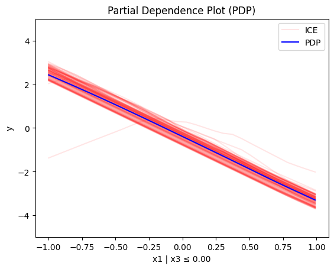
    


    
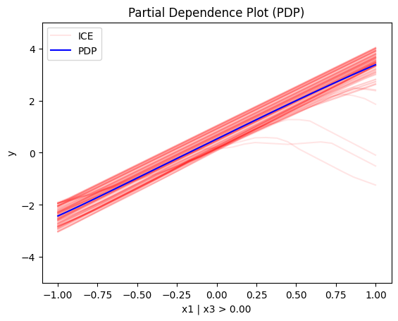
    


```python
regional_pdp.summary(features=1)
```

    
    
    Feature 1 - Full partition tree:
    Node id: 0, name: x2, heter: 3.21 || nof_instances:  1000 || weight: 1.00
    --------------------------------------------------
    Feature 1 - Statistics per tree level:
    Level 0, heter: 3.21
    
    


```python
regional_pdp.summary(features=2)
```

    
    
    Feature 2 - Full partition tree:
    Node id: 0, name: x3, heter: 2.84 || nof_instances:  1000 || weight: 1.00
            Node id: 1, name: x3 | x1 <= 0.0, heter: 0.70 || nof_instances:  1000 || weight: 1.00
            Node id: 2, name: x3 | x1  > 0.0, heter: 0.69 || nof_instances:  1000 || weight: 1.00
    --------------------------------------------------
    Feature 2 - Statistics per tree level:
    Level 0, heter: 2.84
            Level 1, heter: 1.39 || heter drop : 1.45 (units), 51.09% (pcg)
    
    


```python
regional_pdp.plot(feature=2, node_idx=1, heterogeneity="ice", centering=True, y_limits=[-5, 5])
regional_pdp.plot(feature=2, node_idx=2, heterogeneity="ice", centering=True, y_limits=[-5, 5])
```


    

    


    

    


#### Conclusion

For the Global PDP:

   * the average effect of $x_1$ is $0$ with some heterogeneity implied by the interaction with $x_1$. The heterogeneity is expressed with two opposite lines; $-3x_1$ when $x_1 \leq 0$ and $3x_1$ when $x_1 >0$
   * the average effect of $x_2$ to be $0$ without heterogeneity
   * the average effect of $x_3$ to be $x_3$ with some heterogeneity due to the interaction with $x_1$. The heterogeneity is expressed with a discontinuity around $x_3=0$, with either a positive or a negative offset depending on the value of $x_1^i$

--- 

For the Regional PDP:

* For $x_1$, the algorithm finds two regions, one for $x_3 \leq 0$ and one for $x_3 > 0$
  * when $x_3>0$ the effect is $3x_1$
  * when $x_3 \leq 0$, the effect is $-3x_1$
* For $x_2$ the algorithm does not find any subregion 
* For $x_3$, there is a change in the offset:
  * when $x_1>0$ the line is $x_3 - 3x_1^i$ in the first half and $x_3 + 3x_1^i$ later
  * when $x_1<0$ the line is $x_3 + 3x_1^i$ in the first half and $x_3 - 3x_1^i$ later

### Correlated setting


#### Global PDP


```python
pdp = effector.PDP(data=X_cor_train, model=model_cor, feature_names=['x1','x2','x3'], target_name="Y")
pdp.plot(feature=0, centering=True, show_avg_output=False, heterogeneity="ice", y_limits=[-5, 5])
pdp.plot(feature=1, centering=True, show_avg_output=False, heterogeneity="ice", y_limits=[-5, 5])
pdp.plot(feature=2, centering=True, show_avg_output=False, heterogeneity="ice", y_limits=[-5, 5])
```


    
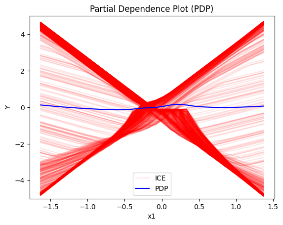
    


    

    


    

    


#### Regional-PDP

```python
regional_pdp = effector.RegionalPDP(data=X_cor_train, model=model_cor, feature_names=['x1', 'x2', 'x3'],
                                    axis_limits=np.array([[-1, 1], [-1, 1], [-1, 1]]).T)
space_partitioner = effector.space_partitioning.Best(heter_pcg_drop_thres=0.4, nof_candidate_splits_for_numerical=10)
regional_pdp.fit(features="all", space_partitioner=space_partitioner)
```

    100%|█████████████████████████████████████████████████████████████████████████████████████████████████████████████████████████████████████████████████████████████████████████| 3/3 [00:00<00:00, 48.64it/s]


```python
regional_pdp.summary(features=0)
```

    
    
    Feature 0 - Full partition tree:
    Node id: 0, name: x1, heter: 2.05 || nof_instances:   900 || weight: 1.00
            Node id: 1, name: x1 | x3 <= 0.0, heter: 0.11 || nof_instances:   900 || weight: 1.00
            Node id: 2, name: x1 | x3  > 0.0, heter: 0.10 || nof_instances:   900 || weight: 1.00
    --------------------------------------------------
    Feature 0 - Statistics per tree level:
    Level 0, heter: 2.05
            Level 1, heter: 0.21 || heter drop : 1.85 (units), 89.81% (pcg)
    
    


```python
regional_pdp.plot(feature=0, node_idx=1, heterogeneity="ice", centering=True, y_limits=[-5, 5])
regional_pdp.plot(feature=0, node_idx=2, heterogeneity="ice", centering=True, y_limits=[-5, 5])
```


    

    


    

    


```python
regional_pdp.summary(features=1)
```

    
    
    Feature 1 - Full partition tree:
    Node id: 0, name: x2, heter: 1.25 || nof_instances:   900 || weight: 1.00
            Node id: 1, name: x2 | x1 <= 0.4, heter: 0.57 || nof_instances:   900 || weight: 1.00
            Node id: 2, name: x2 | x1  > 0.4, heter: 0.49 || nof_instances:   900 || weight: 1.00
    --------------------------------------------------
    Feature 1 - Statistics per tree level:
    Level 0, heter: 1.25
            Level 1, heter: 1.06 || heter drop : 0.19 (units), 15.48% (pcg)
    
    


```python
regional_pdp.summary(features=2)
```

    
    
    Feature 2 - Full partition tree:
    Node id: 0, name: x3, heter: 1.82 || nof_instances:   900 || weight: 1.00
            Node id: 1, name: x3 | x1 <= -0.2, heter: 0.45 || nof_instances:   900 || weight: 1.00
            Node id: 2, name: x3 | x1  > -0.2, heter: 0.57 || nof_instances:   900 || weight: 1.00
    --------------------------------------------------
    Feature 2 - Statistics per tree level:
    Level 0, heter: 1.82
            Level 1, heter: 1.02 || heter drop : 0.80 (units), 44.10% (pcg)
    
    


```python
regional_pdp.plot(feature=2, node_idx=1, heterogeneity="ice", centering=True, y_limits=[-5, 5])
regional_pdp.plot(feature=2, node_idx=2, heterogeneity="ice", centering=True, y_limits=[-5, 5])
```


    
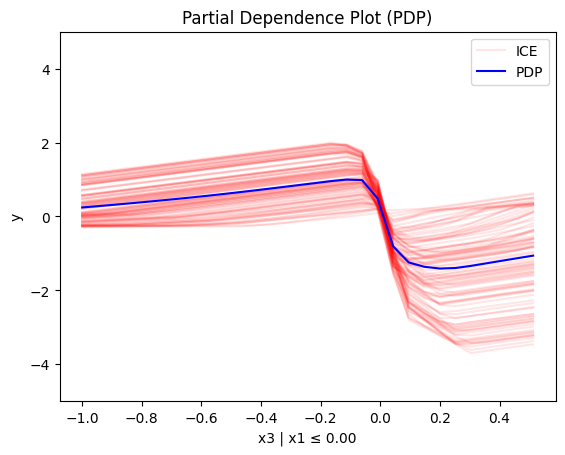
    


    

    


#### Conclusion

## (RH)ALE


```python
def model_uncor_jac(x):
    x_tensor = tf.convert_to_tensor(x, dtype=tf.float32)
    with tf.GradientTape() as t:
        t.watch(x_tensor)
        pred = model_uncor(x_tensor)
        grads = t.gradient(pred, x_tensor)
    return grads.numpy()

def model_cor_jac(x):
    x_tensor = tf.convert_to_tensor(x, dtype=tf.float32)
    with tf.GradientTape() as t:
        t.watch(x_tensor)
        pred = model_cor(x_tensor)
        grads = t.gradient(pred, x_tensor)
    return grads.numpy()
```

### Uncorrelated setting

#### Global RHALE


```python
rhale = effector.RHALE(data=X_uncor_train, model=model_uncor, model_jac=model_uncor_jac, feature_names=['x1','x2','x3'], target_name="Y")

binning_method = effector.axis_partitioning.Fixed(10, min_points_per_bin=0)
rhale.fit(features="all", binning_method=binning_method, centering=True)

rhale.plot(feature=0, centering=True, heterogeneity="std", show_avg_output=False, y_limits=[-5, 5], dy_limits=[-5, 5])
rhale.plot(feature=1, centering=True, heterogeneity="std", show_avg_output=False, y_limits=[-5, 5], dy_limits=[-5, 5])
rhale.plot(feature=2, centering=True, heterogeneity="std", show_avg_output=False, y_limits=[-5, 5], dy_limits=[-5, 5])
```


    
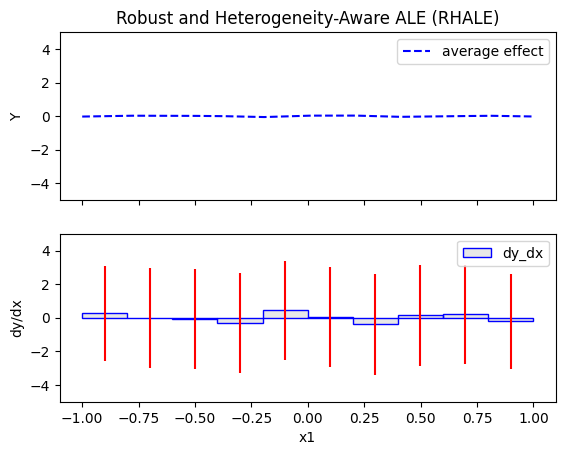
    


    

    


    
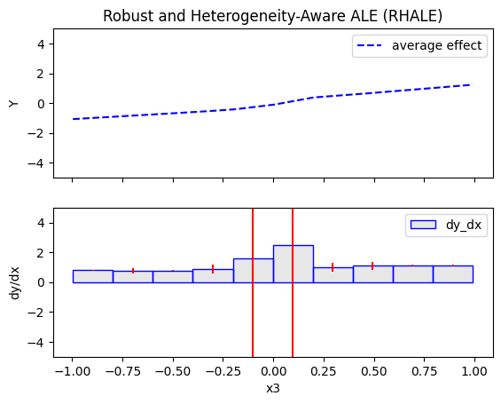
    


#### Regional RHALE

```python
regional_rhale = effector.RegionalRHALE(
 data=X_uncor_train,
 model=model_uncor,
 model_jac=model_uncor_jac,
 feature_names=['x1', 'x2', 'x3'],
 axis_limits=np.array([[-1, 1], [-1, 1], [-1, 1]]).T)

binning_method = effector.axis_partitioning.Fixed(11, min_points_per_bin=0)
space_partitioner = effector.space_partitioning.Best(heter_pcg_drop_thres=0.6, nof_candidate_splits_for_numerical=10)
regional_rhale.fit(
 features="all",
 binning_method=binning_method,
 space_partitioner=space_partitioner
)

```

    100%|█████████████████████████████████████████████████████████████████████████████████████████████████████████████████████████████████████████████████████████████████████████| 3/3 [00:00<00:00, 16.63it/s]


```python
regional_rhale.summary(features=0)
```

    
    
    Feature 0 - Full partition tree:
    Node id: 0, name: x1, heter: 8.34 || nof_instances:  1000 || weight: 1.00
            Node id: 1, name: x1 | x3 <= 0.0, heter: 0.31 || nof_instances:  1000 || weight: 1.00
            Node id: 2, name: x1 | x3  > 0.0, heter: 0.27 || nof_instances:  1000 || weight: 1.00
    --------------------------------------------------
    Feature 0 - Statistics per tree level:
    Level 0, heter: 8.34
            Level 1, heter: 0.58 || heter drop : 7.76 (units), 93.08% (pcg)
    
    


```python
regional_rhale.plot(feature=0, node_idx=1, heterogeneity="std", centering=True, y_limits=[-5, 5])
regional_rhale.plot(feature=0, node_idx=2, heterogeneity="std", centering=True, y_limits=[-5, 5])
```


    

    


    
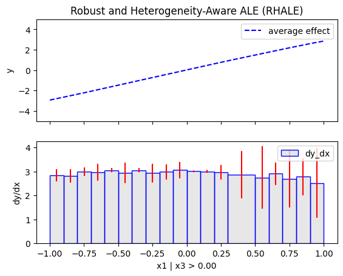
    


```python
regional_rhale.summary(features=1)
```

    
    
    Feature 1 - Full partition tree:
    Node id: 0, name: x2, heter: 0.02 || nof_instances:  1000 || weight: 1.00
    --------------------------------------------------
    Feature 1 - Statistics per tree level:
    Level 0, heter: 0.02
    
    


```python
regional_rhale.summary(features=2)
```

    
    
    Feature 2 - Full partition tree:
    Node id: 0, name: x3, heter: 48.54 || nof_instances:  1000 || weight: 1.00
    --------------------------------------------------
    Feature 2 - Statistics per tree level:
    Level 0, heter: 48.54
    
    


#### Conclusion

### Correlated setting

#### Global RHALE


```python
rhale = effector.RHALE(data=X_cor_train, model=model_cor, model_jac=model_cor_jac, feature_names=['x1','x2','x3'], target_name="Y")

binning_method = effector.axis_partitioning.Fixed(10, min_points_per_bin=0)
rhale.fit(features="all", binning_method=binning_method, centering=True)
```


```python
rhale.plot(feature=0, centering=True, heterogeneity="std", show_avg_output=False, y_limits=[-5, 5], dy_limits=[-5, 5])
rhale.plot(feature=1, centering=True, heterogeneity="std", show_avg_output=False, y_limits=[-5, 5], dy_limits=[-5, 5])
rhale.plot(feature=2, centering=True, heterogeneity="std", show_avg_output=False, y_limits=[-5, 5], dy_limits=[-5, 5])
```


    

    


    

    


    

    


#### Regional RHALE

```python
regional_rhale = effector.RegionalRHALE(
 data=X_cor_train,
 model=model_cor,
 model_jac=model_cor_jac,
 feature_names=['x1', 'x2', 'x3'],
 axis_limits=np.array([[-1, 1], [-1, 1], [-1, 1]]).T)

binning_method = effector.axis_partitioning.Fixed(11, min_points_per_bin=0)
space_partitioner = effector.space_partitioning.Best(heter_pcg_drop_thres=0.6, nof_candidate_splits_for_numerical=10)
regional_rhale.fit(
 features="all",
 space_partitioner=space_partitioner,
)
```

    100%|█████████████████████████████████████████████████████████████████████████████████████████████████████████████████████████████████████████████████████████████████████████| 3/3 [00:00<00:00, 16.77it/s]


```python
regional_rhale.summary(features=0)
```

    
    
    Feature 0 - Full partition tree:
    Node id: 0, name: x1, heter: 2.33 || nof_instances:   900 || weight: 1.00
    --------------------------------------------------
    Feature 0 - Statistics per tree level:
    Level 0, heter: 2.33
    
    


```python
regional_rhale.summary(features=1)
```

    
    
    Feature 1 - Full partition tree:
    Node id: 0, name: x2, heter: 0.01 || nof_instances:   900 || weight: 1.00
    --------------------------------------------------
    Feature 1 - Statistics per tree level:
    Level 0, heter: 0.01
    
    


```python
regional_rhale.summary(features=2)
```

    
    
    Feature 2 - Full partition tree:
    Node id: 0, name: x3, heter: 15.84 || nof_instances:   900 || weight: 1.00
    --------------------------------------------------
    Feature 2 - Statistics per tree level:
    Level 0, heter: 15.84
    
    


#### Conclusion

## SHAP DP
### Uncorrelated setting
#### Global SHAP DP


```python
shap = effector.ShapDP(data=X_uncor_train, model=model_uncor, feature_names=['x1', 'x2', 'x3'], target_name="Y")
binning_method = effector.axis_partitioning.Fixed(nof_bins=5, min_points_per_bin=0)
shap.fit(features="all", binning_method=binning_method, centering=True)
shap.plot(feature=0, centering=True, heterogeneity="shap_values", show_avg_output=False, y_limits=[-3, 3])
shap.plot(feature=1, centering=True, heterogeneity="shap_values", show_avg_output=False, y_limits=[-3, 3])
shap.plot(feature=2, centering=True, heterogeneity="shap_values", show_avg_output=False, y_limits=[-3, 3])

```


    

    


    

    


    
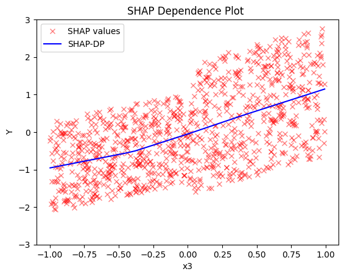
    


#### Regional SHAP-DP

```python
regional_shap = effector.RegionalShapDP(
 data=X_uncor_train,
 model=model_uncor,
 feature_names=['x1', 'x2', 'x3'],
 axis_limits=np.array([[-1, 1], [-1, 1], [-1, 1]]).T)

space_partitioner = effector.space_partitioning.Best(heter_pcg_drop_thres=0.6, nof_candidate_splits_for_numerical=10)
regional_shap.fit(
 features="all",
 space_partitioner=space_partitioner,
 binning_method=effector.axis_partitioning.Fixed(nof_bins=5, min_points_per_bin=0)
)

```

    100%|█████████████████████████████████████████████████████████████████████████████████████████████████████████████████████████████████████████████████████████████████████████| 3/3 [00:04<00:00,  1.45s/it]


```python
regional_shap.summary(0)
```

    
    
    Feature 0 - Full partition tree:
    Node id: 0, name: x1, heter: 0.81 || nof_instances:  1000 || weight: 1.00
            Node id: 1, name: x1 | x3 <= 0.0, heter: 0.04 || nof_instances:  1000 || weight: 1.00
            Node id: 2, name: x1 | x3  > 0.0, heter: 0.03 || nof_instances:  1000 || weight: 1.00
    --------------------------------------------------
    Feature 0 - Statistics per tree level:
    Level 0, heter: 0.81
            Level 1, heter: 0.07 || heter drop : 0.74 (units), 91.25% (pcg)
    
    


```python
regional_shap.plot(feature=0, node_idx=1, heterogeneity="std", centering=True, y_limits=[-5, 5])
regional_shap.plot(feature=0, node_idx=2, heterogeneity="std", centering=True, y_limits=[-5, 5])
```


    
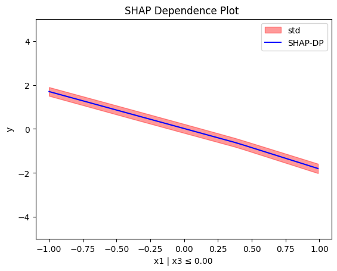
    


    
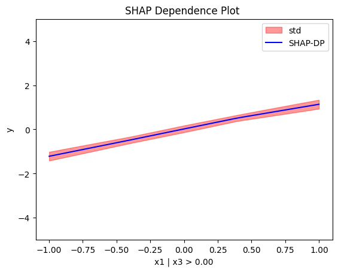
    


```python
regional_shap.summary(features=1)
```

    
    
    Feature 1 - Full partition tree:
    Node id: 0, name: x2, heter: 0.00 || nof_instances:  1000 || weight: 1.00
    --------------------------------------------------
    Feature 1 - Statistics per tree level:
    Level 0, heter: 0.00
    
    


```python
regional_shap.summary(features=2)
```

    
    
    Feature 2 - Full partition tree:
    Node id: 0, name: x3, heter: 0.76 || nof_instances:  1000 || weight: 1.00
            Node id: 1, name: x3 | x1 <= 0.0, heter: 0.25 || nof_instances:  1000 || weight: 1.00
            Node id: 2, name: x3 | x1  > 0.0, heter: 0.33 || nof_instances:  1000 || weight: 1.00
    --------------------------------------------------
    Feature 2 - Statistics per tree level:
    Level 0, heter: 0.76
            Level 1, heter: 0.58 || heter drop : 0.17 (units), 22.98% (pcg)
    
    


#### Conclusion

### Correlated setting

#### Global SHAP-DP


```python

shap = effector.ShapDP(data=X_cor_train, model=model_cor, feature_names=['x1', 'x2', 'x3'], target_name="Y")
binning_method = effector.axis_partitioning.Fixed(nof_bins=5, min_points_per_bin=0)
shap.fit(features="all", binning_method=binning_method, centering=True)
shap.plot(feature=0, centering=True, heterogeneity="shap_values", show_avg_output=False, y_limits=[-3, 3])
shap.plot(feature=1, centering=True, heterogeneity="shap_values", show_avg_output=False, y_limits=[-3, 3])
shap.plot(feature=2, centering=True, heterogeneity="shap_values", show_avg_output=False, y_limits=[-3, 3])

```


    
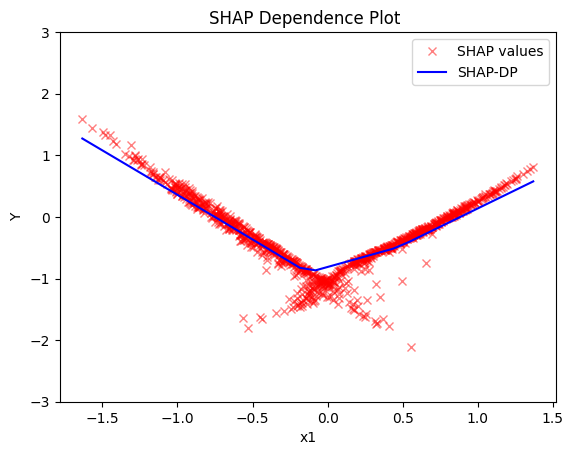
    


    
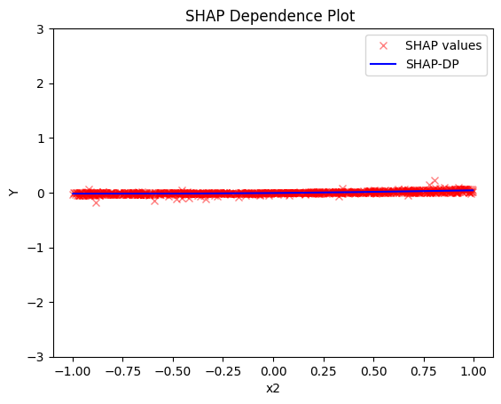
    


    

    


#### Regional SHAP

```python
regional_shap = effector.RegionalShapDP(
 data=X_cor_train,
 model=model_cor,
 feature_names=['x1', 'x2', 'x3'],
 axis_limits=np.array([[-1, 1], [-1, 1], [-1, 1]]).T)

space_partitioner = effector.space_partitioning.Best(heter_pcg_drop_thres=0.6, nof_candidate_splits_for_numerical=10)
regional_shap.fit(
 features="all",
 space_partitioner=space_partitioner,
 binning_method=effector.axis_partitioning.Fixed(nof_bins=5, min_points_per_bin=0)
)
```

    100%|█████████████████████████████████████████████████████████████████████████████████████████████████████████████████████████████████████████████████████████████████████████| 3/3 [00:04<00:00,  1.38s/it]


```python
regional_shap.summary(0)
regional_shap.summary(1)
regional_shap.summary(2)
```

    
    
    Feature 0 - Full partition tree:
    Node id: 0, name: x1, heter: 0.07 || nof_instances:   900 || weight: 1.00
    --------------------------------------------------
    Feature 0 - Statistics per tree level:
    Level 0, heter: 0.07
    
    
    
    
    Feature 1 - Full partition tree:
    Node id: 0, name: x2, heter: 0.00 || nof_instances:   900 || weight: 1.00
    --------------------------------------------------
    Feature 1 - Statistics per tree level:
    Level 0, heter: 0.00
    
    
    
    
    Feature 2 - Full partition tree:
    Node id: 0, name: x3, heter: 0.09 || nof_instances:   900 || weight: 1.00
    --------------------------------------------------
    Feature 2 - Statistics per tree level:
    Level 0, heter: 0.09
    
    


#### Conclusion


